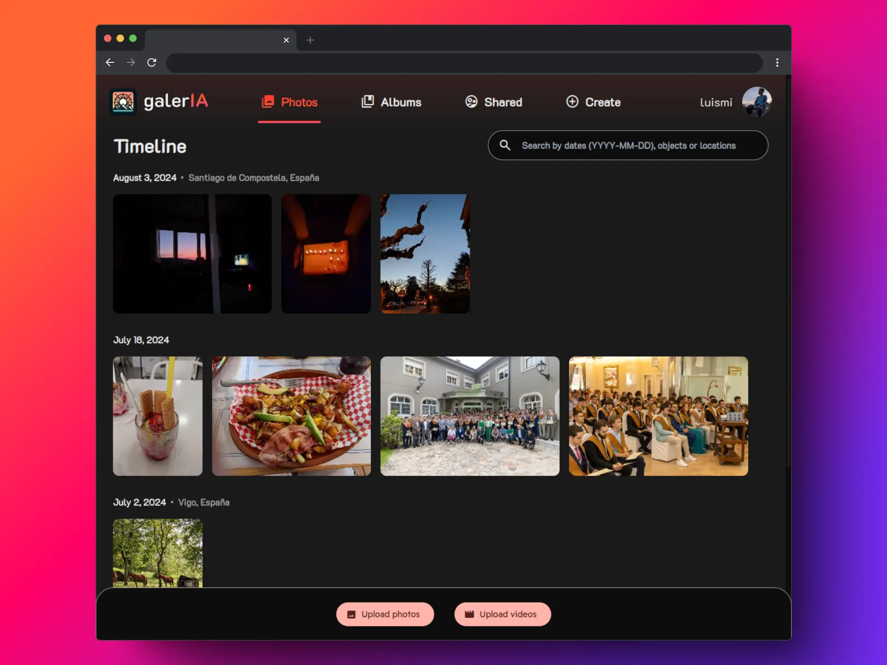

  

<h2 align="center">An open source gallery web application with AI features executed on the browser</h2>

## Features

- **Multimedia management**: Upload, organize and share albums to other users.
- **Object detection**: Search through your gallery by objects in the image by using YOLOv8.
- **Image upscaling**: Enhance low resolution images with Remacri.
- **Image generation**: Generate any image you want quickly with the power of Stable Diffussion Turbo.

## Prerequisites

### Client side

To execute most of the models contained in this project, you need to be running the following setup:

- **Browser**: Any browser that supports the WebGPU API. It can be a **recent version of a Chromium-based browser** (Chrome, Edge, Brave, etc.) or a **nightly version of Firefox** with the `about:config` flag `dom.webgpu.enabled` set to `true`. Test it [here](https://webgpureport.org/) or inside the app. `shader-f16` should be listed as a feature to be able to use image generation.

**Linux users**: You may need to enable the `#enable-unsafe-webgpu` flag in `chrome://flags` to use WebGPU.

- **GPU**: A **dedicated/integrated GPU** with at least enough VRAM/system RAM:
  - **Image upscaling**: Currently up to 2GiB for a max resolution of 362x362.
  - **Image generation (Stable Diffusion Turbo)**: 4GiB for resolutions <= 256x256, 8GiB for resolutions <= 512x512, 16GB for resolutions above.

### Server side

- **Linux environment**: The application was developed and tested in a Linux environment. It may work in other environments, but it is not guaranteed.
- **Docker Compose**: To run the database, application and web server in containerized environments (or just database in development profile).

For local development, you will also need:

- **Python >=3.11**: To run Django backend. Preferably in a virtual environment.
- **NPM**: To run frontend.

## Installation

### Docker

1. Clone the repository: `git clone https://github.com/luismiaresse/galeria`
2. Run scripts depending on desired profile:

- `devserver.sh` for development:
  - Install Python dependencies: `cd app/backend && pip install -r requirements.txt`
  - Install NPM dependencies: `cd app/frontend && npm install`
  - Run the script with `chmod +x ./devserver.sh && ./devserver.sh` and access the app at `http://localhost:5173`.
- `prodserver.sh` for production: Just run `chmod +x ./prodserver.sh && ./prodserver.sh` and go to `https://www.galeria.software` (or your custom domain). Note that you will need to provide SSL certificates and a SSL key in the `server/ssl` folder.

## License

Licensed under AGPLv3. This should be in any fork or redistribution, and should credit contributors as well. See [LICENSE](LICENSE) for more information.
